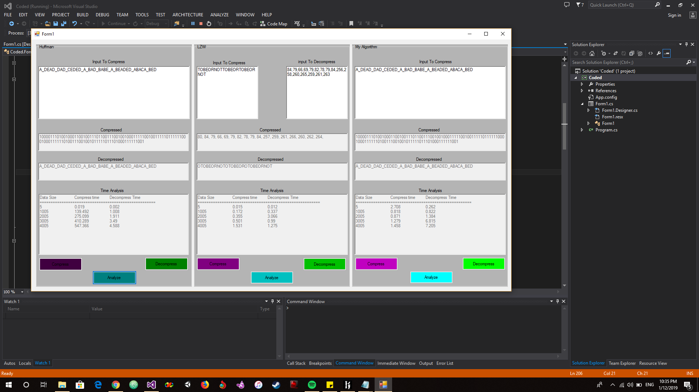

# Compression-Algorithms
Compression Algorithms Using C#
### Algorithms:
Huffman Algorithm.  
Lempel–Ziv–Welch (LZW - LZ78).  
And a combination of both algorithms.  
Also it analyzes the compression time and ratio of all Three Algorithms.  

